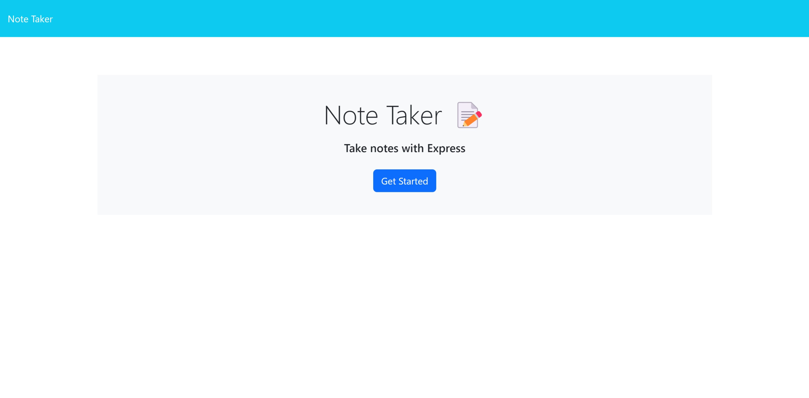
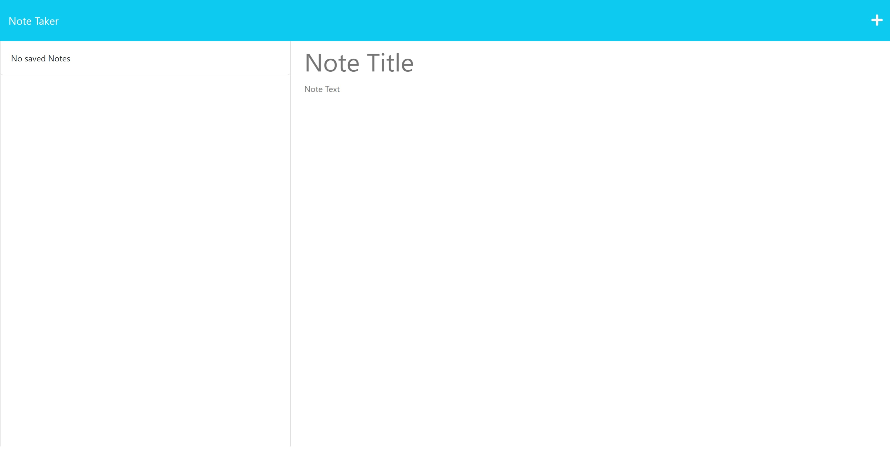
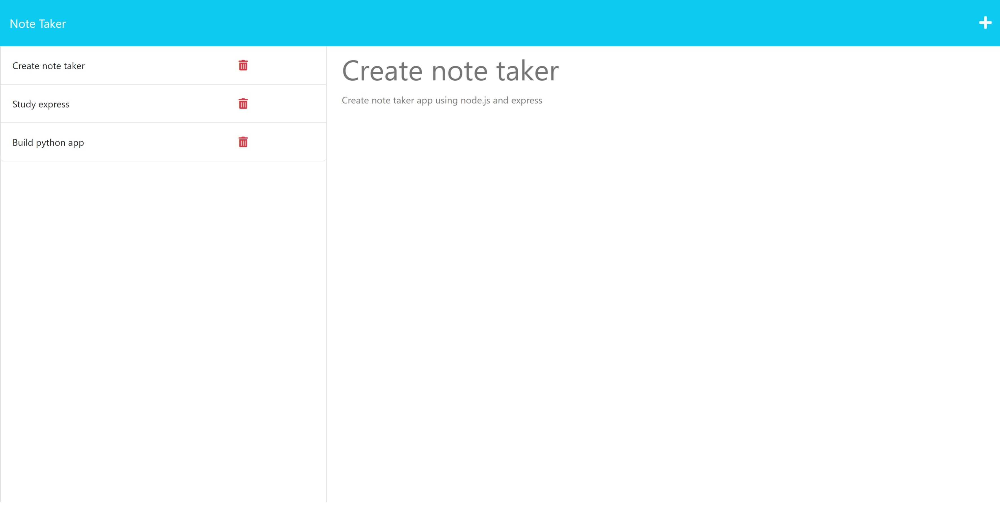
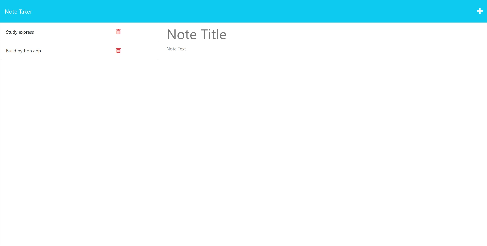

<!-- omit in toc -->
# Note Taker

<!-- omit in toc -->
## Description

This is a simple application that can be used to write and save notes using an Express.js backend. User can add a new note with a title and text, see existing notes, and delete a note.

You can check out the deployed application from the link below:

<!-- omit in toc -->
## Table of Contents
- [Installation](#installation)
- [Usage](#usage)
- [License](#license)

## Installation
- Install [Node.js v16](https://nodejs.org/en/blog/release/v16.16.0/) and [npm](https://www.npmjs.com/)
- Install npm packages:
  ```
  npm install
  ```

## Usage
- Execute the app:
  ```
  npm start
  ```

- Index page


- Notes page


- Notes after adding


- Notes after deleting



## License
Copyright © 2022 [Claire Cho](https://github.com/clairehwcho).